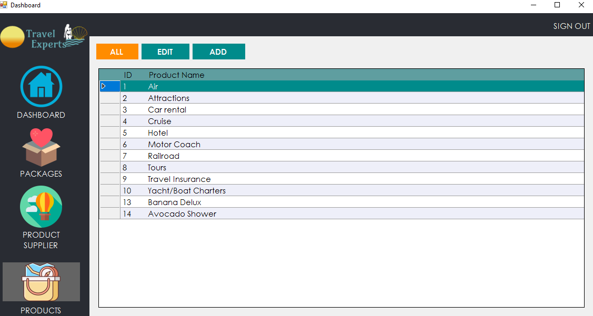
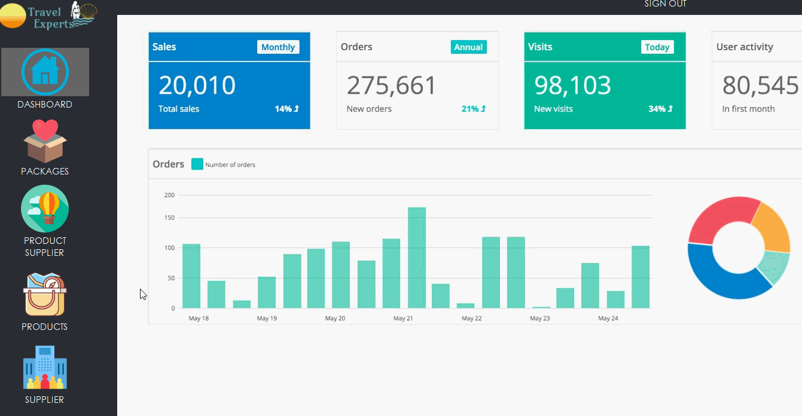
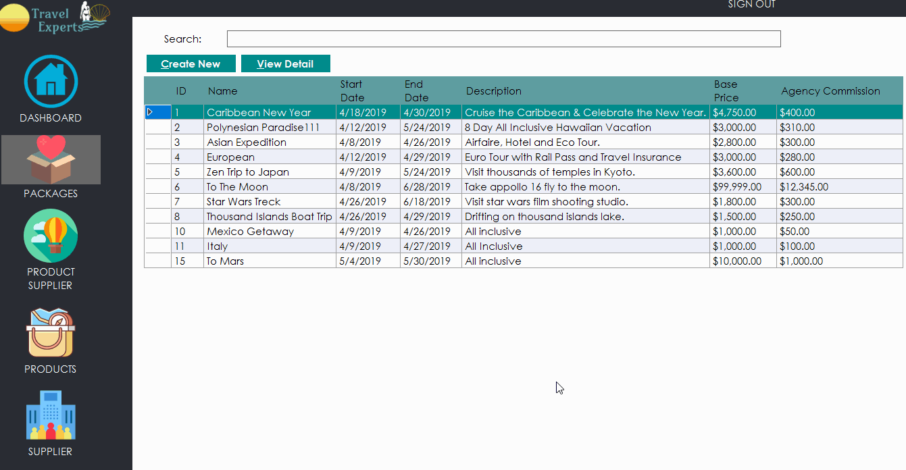
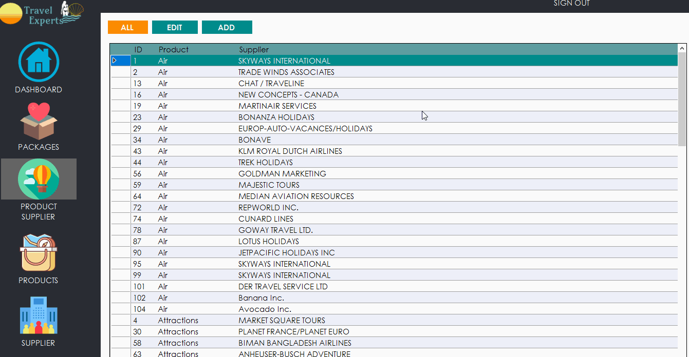
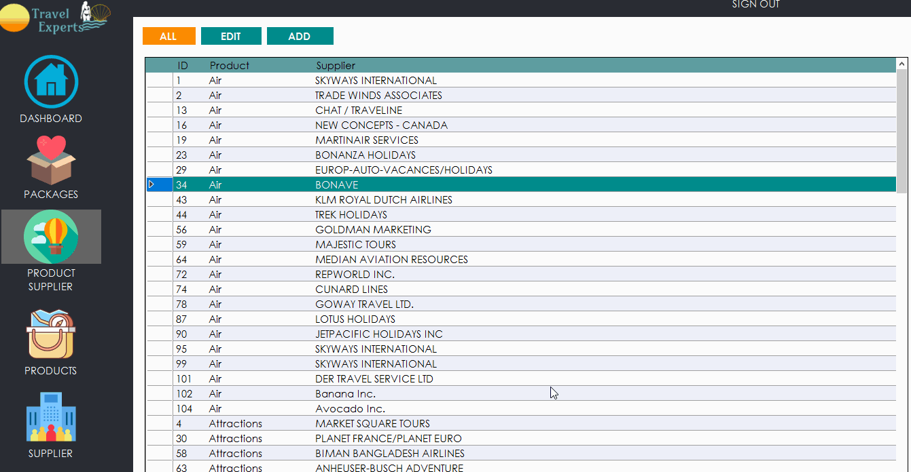
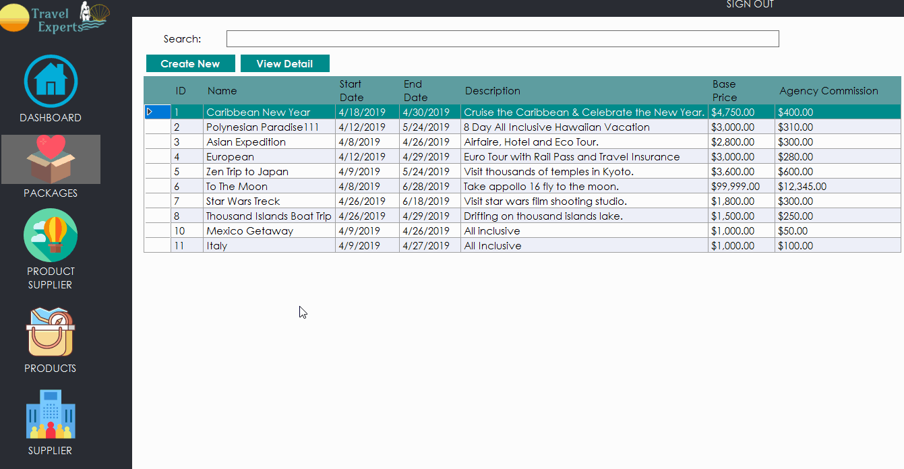
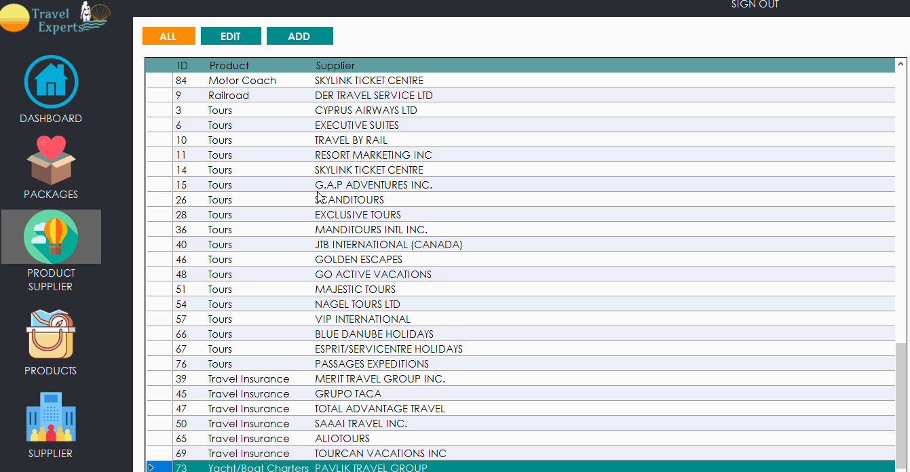
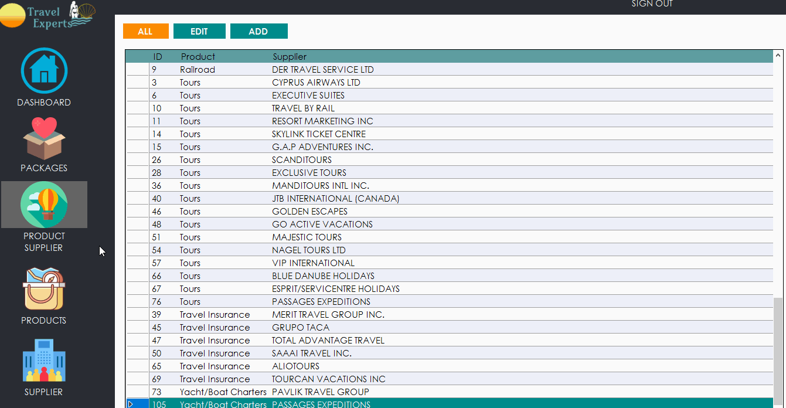

# Travel-Agency-Desktop-App
## App Overview
<kbd>
  
</kbd>
<br>
<h1></h1>
<h6 align="center"> A database management Windows desktop application for a travel agency.
Build with C# and MS Visual Studio. </h6>

<h1></h1>

## Before using
To run the app, please install Microsoft SQL Server and add database by running sql script under repository root directory.
```
Travel-Agency-Desktop-App\travelexperts-mssql.sql
```

## Convenient features

### Easy Navigation
</img>

### Search
</img>
<br>Filter results while user is typing.

### Sort
</img>
<br>Easy sort just by clicking column head.

### Auto-complete
</img>
<br>Predict user's choice from the dropdown list.

## How to use

### Add a new package
</img>

### Add / Edit product supplier
</img>

### Add a new supplier
</img>

## Built With
* IDE - *Microsoft Visual Studio Enterprise 2017*
* Database - *SQL Server*
* Language - *C#*

## Author
* **DongMing Hu** - [hdmdhr](https://github.com/hdmdhr)
* **Louise Acosta** - [louiseanacosta](https://github.com/louiseanacosta)
* **Ibraheem** - [kabaltech](https://github.com/kabaltech)
